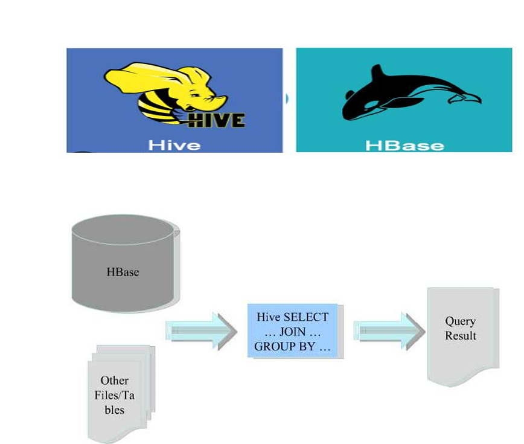

# Hive-and-Hbase-integration
Integrate Hiva and Hbase

## 🧩 HBase and Hive Integration Use Case
This project demonstrates how to integrate Apache HBase with Apache Hive for querying structured NoSQL data using SQL-like syntax. The use case involves storing system logs in HBase and querying them via Hive.

### 🗃️ HBase Implementation
Start HBase:

bash
Copy
Edit
start-hbase.sh
hbase shell
Create Namespace and Table:

bash
Copy
Edit
create_namespace 'bigdata'
create 'bigdata:AnalysisLog_ID', 'LogInfo'
Insert Log Data into HBase:
Example entries:

bash
Copy
Edit
put 'bigdata:AnalysisLog_ID', '001', 'LogInfo:hostname', 'FI01Miner01'
put 'bigdata:AnalysisLog_ID', '001', 'LogInfo:service', 'miner'
put 'bigdata:AnalysisLog_ID', '001', 'LogInfo:type', 'info'
The log data contains fields like hostname, service, and type, stored under the LogInfo column family.

### 🐝 Hive Integration
Create External Hive Table Mapped to HBase:

sql
Copy
Edit
CREATE EXTERNAL TABLE Log_hive_ID (
  row_key STRING,
  hostname STRING,
  service STRING,
  type STRING
)
STORED BY 'org.apache.hadoop.hive.hbase.HBaseStorageHandler'
WITH SERDEPROPERTIES (
  "hbase.columns.mapping" = ":key,LogInfo:hostname,LogInfo:service,LogInfo:type"
)
TBLPROPERTIES (
  "hbase.table.name" = "bigdata:AnalysisLog_ID"
);
Query Data from HBase via Hive:

sql
Copy
Edit
SELECT * FROM Log_hive_ID WHERE service = 'miner';
### 🎯 Purpose
This integration allows:

Efficient storage of semi-structured log data using HBase.

SQL-style querying and reporting on top of HBase using Hive.

Seamless bridging of NoSQL storage with traditional BI tools.
